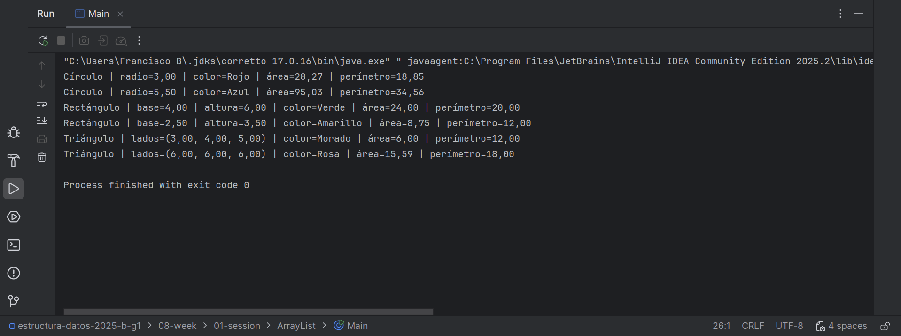

# Taller: Uso de ArrayList con Clases en Java

## Descripción
Este es un trabajo en el que se implementan tres clases
de figuras geométricas, que son el Circulo, Rectangulo y
Triangulo, que permiten calcular su área, perímetro y mostrar
información descriptiva.  
Los objetos creados se almacenan en un ArrayList y luego se 
recorre la lista para imprimir los resultados en consola.

## El código está diseñado de la siguiente manera:
- `CalculoFiguras.java` que es la interfaz con los 
métodos`calcularArea`, `calcularPerimetro` y `mostrarInformacion`.
- `Circulo.java` es la clase que representa un círculo.
- `Rectangulo.java` es la clase que representa un rectángulo.
- `Triangulo.java` es la clase que representa un triángulo.
- `Main.java` es la clase principal donde se crean los objetos,
se insertan en el ArrayList y se muestran los resultados.

## Al hacer la ejecución:
El programa creará objetos de cada figura, que los agregará a 
un `ArrayList<CalculoFiguras>` y recorrerá la lista mostrando 
sus áreas y perímetros.

## Evidencia del trabajo
 
